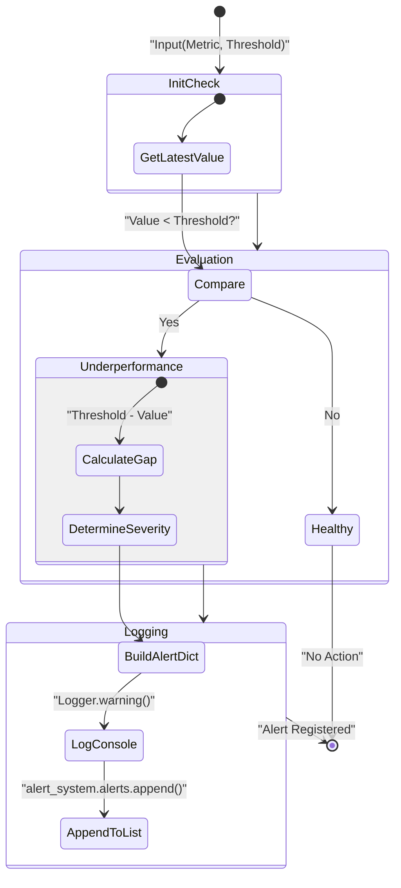

```mermaid
stateDiagram-v2

%% Level 3 Abstraction: Alert Lifecycle
[*] --> InitCheck: "Input(Metric, Threshold)"

state InitCheck {
    [*] --> GetLatestValue
    GetLatestValue --> Compare: "Value < Threshold?"
}

InitCheck --> Evaluation

state Evaluation {
    Compare --> Underperformance: Yes
    Compare --> Healthy: No

    state Underperformance {
        [*] --> CalculateGap: "Threshold - Value"
        CalculateGap --> DetermineSeverity
        DetermineSeverity --> BuildAlertDict
    }
}

Healthy --> [*]: "No Action"

state Logging {
    BuildAlertDict --> LogConsole: "Logger.warning()"
    LogConsole --> AppendToList: "alert_system.alerts.append()"
}

Underperformance --> Logging
Logging --> [*]: "Alert Registered"
 
```