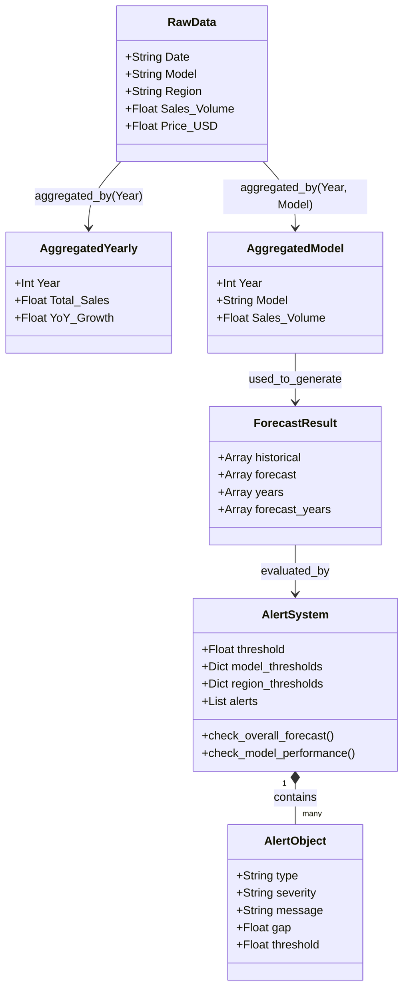

```mermaid
classDiagram
    %% Level 2 Abstraction: Data Entities
    class RawData {
        +String Date
        +String Model
        +String Region
        +Float Sales_Volume
        +Float Price_USD
    }

    class AggregatedYearly {
        +Int Year
        +Float Total_Sales
        +Float YoY_Growth
    }

    class AggregatedModel {
        +Int Year
        +String Model
        +Float Sales_Volume
    }

    class AlertSystem {
        +Float threshold
        +Dict model_thresholds
        +Dict region_thresholds
        +List alerts
        +check_overall_forecast()
        +check_model_performance()
    }

    class AlertObject {
        +String type
        +String severity
        +String message
        +Float gap
        +Float threshold
    }

    class ForecastResult {
        +Array historical
        +Array forecast
        +Array years
        +Array forecast_years
    }

    RawData --> AggregatedYearly : aggregated_by(Year)
    RawData --> AggregatedModel : aggregated_by(Year, Model)
    AlertSystem "1" *-- "many" AlertObject : contains
    AggregatedModel --> ForecastResult : used_to_generate
    ForecastResult --> AlertSystem : evaluated_by
```