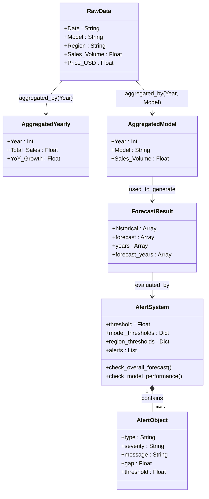

```mermaid
classDiagram

%% Level 2 Abstraction: Data Entities
class RawData {
    +Date : String
    +Model : String
    +Region : String
    +Sales_Volume : Float
    +Price_USD : Float
}

class AggregatedYearly {
    +Year : Int
    +Total_Sales : Float
    +YoY_Growth : Float
}

class AggregatedModel {
    +Year : Int
    +Model : String
    +Sales_Volume : Float
}

class AlertSystem {
    +threshold : Float
    +model_thresholds : Dict
    +region_thresholds : Dict
    +alerts : List
    +check_overall_forecast()
    +check_model_performance()
}

class AlertObject {
    +type : String
    +severity : String
    +message : String
    +gap : Float
    +threshold : Float
}

class ForecastResult {
    +historical : Array
    +forecast : Array
    +years : Array
    +forecast_years : Array
}

RawData --> AggregatedYearly : aggregated_by(Year)
RawData --> AggregatedModel : aggregated_by(Year, Model)
AlertSystem "1" *-- "many" AlertObject : contains
AggregatedModel --> ForecastResult : used_to_generate
ForecastResult --> AlertSystem : evaluated_by
 
```
