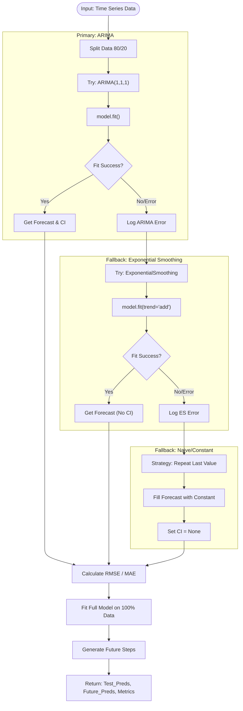

```mermaid
flowchart TD
    %% Level 3 Abstraction: Forecasting Algorithm
    Start(["Input: Time Series Data"]) --> Split["Split Data 80/20"]

    subgraph PrimaryModel ["Primary: ARIMA"]
        Split --> TryARIMA["Try: ARIMA(1,1,1)"]
        TryARIMA --> FitARIMA["model.fit()"]
        FitARIMA --> SuccessARIMA{Fit Success?}
        SuccessARIMA -- Yes --> CalcARIMA["Get Forecast & CI"]
        SuccessARIMA -- No/Error --> LogError1["Log ARIMA Error"]
    end

    subgraph Fallback1 ["Fallback: Exponential Smoothing"]
        LogError1 --> TryES["Try: ExponentialSmoothing"]
        TryES --> FitES["model.fit(trend='add')"]
        FitES --> SuccessES{Fit Success?}
        SuccessES -- Yes --> CalcES["Get Forecast (No CI)"]
        SuccessES -- No/Error --> LogError2["Log ES Error"]
    end

    subgraph Fallback2 ["Fallback: Naive/Constant"]
        LogError2 --> UseNaive["Strategy: Repeat Last Value"]
        UseNaive --> FillData["Fill Forecast with Constant"]
        FillData --> SetCINone["Set CI = None"]
    end

    CalcARIMA --> CalcMetrics["Calculate RMSE / MAE"]
    CalcES --> CalcMetrics
    SetCINone --> CalcMetrics

    CalcMetrics --> FutureForecasting["Fit Full Model on 100% Data"]
    FutureForecasting --> GenerateFuture["Generate Future Steps"]
    GenerateFuture --> Return["Return: Test_Preds, Future_Preds, Metrics"]
```