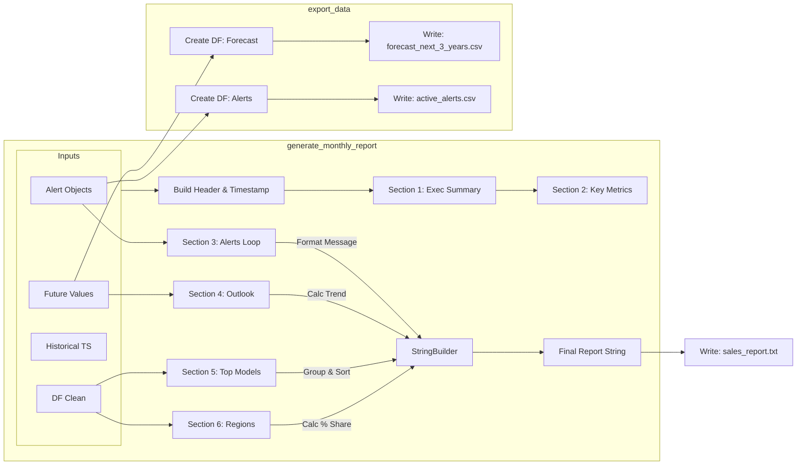

```mermaid
flowchart LR
    %% Level 2 Abstraction: Reporting Data Flow
    
    subgraph Inputs
        Alerts[Alert Objects]
        Forecast[Future Values]
        History[Historical TS]
        CleanData[DF Clean]
    end

    subgraph ReportGenerator [generate_monthly_report]
        Inputs --> Header[Build Header & Timestamp]
        Header --> ExecSum[Section 1: Exec Summary]
        ExecSum --> Metrics[Section 2: Key Metrics]
        
        Alerts --> AlertSec[Section 3: Alerts Loop]
        AlertSec -->|Format Message| StringBuilder
        
        Forecast --> Outlook[Section 4: Outlook]
        Outlook -->|Calc Trend| StringBuilder
        
        CleanData --> TopModels[Section 5: Top Models]
        TopModels -->|Group & Sort| StringBuilder
        
        CleanData --> Regions[Section 6: Regions]
        Regions -->|Calc % Share| StringBuilder
        
        StringBuilder --> FinalString[Final Report String]
    end

    subgraph ExportGenerator [export_data]
        Forecast --> DF_Fcst[Create DF: Forecast]
        DF_Fcst --> CSV_Fcst[Write: forecast_next_3_years.csv]
        
        Alerts --> DF_Alerts[Create DF: Alerts]
        DF_Alerts --> CSV_Alerts[Write: active_alerts.csv]
    end

    FinalString --> TxtFile[Write: sales_report.txt]
 
```