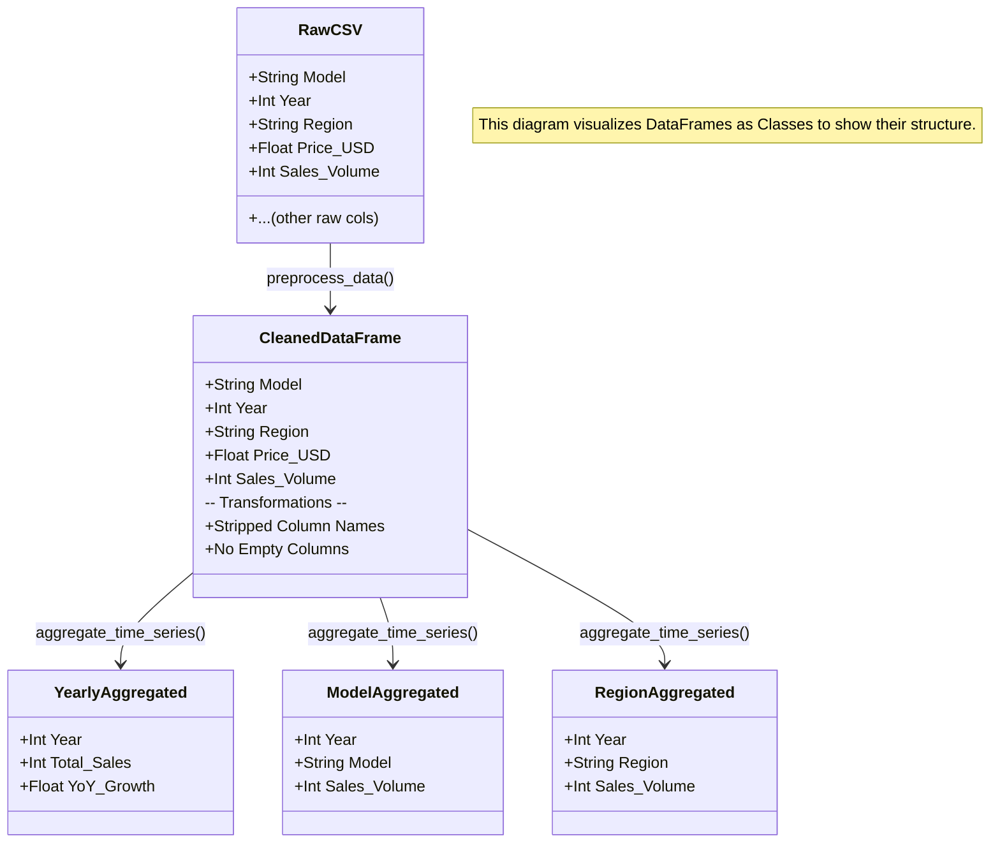
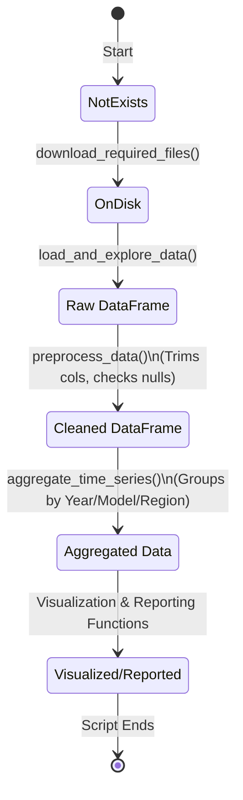
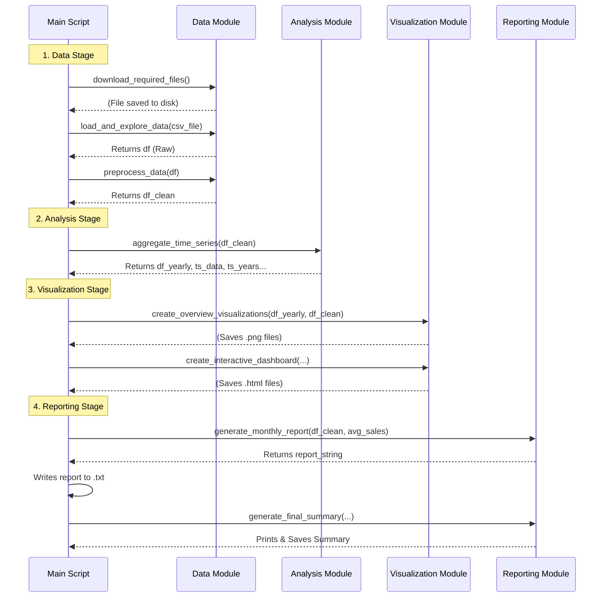

# Educational Diagrams for `bmw_v3_simple-from-colab.py`

These diagrams provide different perspectives on the code to help a beginner understand not just the *flow* (execution order), but also the *data structure*, *data lifecycle*, and *function interactions*.

## 1. Data Structure Diagram (Class Diagram Style)

**Concept:** Although the code uses Pandas DataFrames and not custom classes, visualizing the "Schema" of the data at different stages helps you understand what columns are available.

**Level 5 Abstraction:** Shows the key DataFrames and their primary columns/types.

## 2. Data Lifecycle (State Diagram)

**Concept:** This shows how the *state* of your data changes as it moves through the pipeline. It answers "What condition is my data in right now?"

**Level 5 Abstraction:** Focuses on the major transformations of the dataset.

## 3. Function Interaction (Sequence Diagram)

**Concept:** This shows the "conversation" between the main script and the helper functions. It highlights the *input* (arguments) and *output* (return values) of each call.

**Level 5 Abstraction:** Shows the Main Script as the controller calling specific functional blocks.

