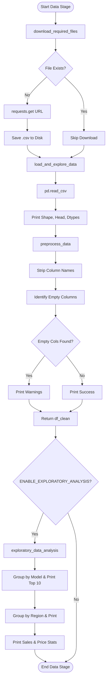

# Execution Flowcharts for `bmw_v3_simple-from-colab.py`

These flowcharts illustrate the execution logic of the script at approximately Level 5 abstraction (showing function calls, key logical branches, and data flow).

## 1. High-Level Pipeline Overview (Level 1-2)

This chart shows the main stages of the script execution controlled by feature flags.

```mermaid
graph TD
    Start([Start Script]) --> Init[Initialize Variables & Clean Outputs]
    Init --> CheckData{ENABLE_DATA_PROCESSING?}
    
    CheckData -- Yes --> DataStage[Data Loading & Preprocessing]
    CheckData -- No --> CheckTS
    DataStage --> CheckTS{ENABLE_TIME_SERIES?}
    
    CheckTS -- Yes --> AnalysisStage[Time Series Aggregation]
    CheckTS -- No --> CheckStatic
    AnalysisStage --> CheckStatic{ENABLE_STATIC_PLOTS?}
    
    CheckStatic -- Yes --> StaticVizStage[Static Visualizations]
    CheckStatic -- No --> CheckReport
    StaticVizStage --> CheckReport{ENABLE_REPORTING?}
    
    CheckReport -- Yes --> ReportStage[Reporting - Monthly]
    CheckReport -- No --> CheckDash
    ReportStage --> CheckDash{ENABLE_DASHBOARDS?}
    
    CheckDash -- Yes --> DashStage[Interactive Dashboards]
    CheckDash -- No --> CheckAgg
    DashStage --> CheckAgg{ENABLE_AGGREGATOR?}
    
    CheckAgg -- Yes --> AggStage[Aggregator & Zip]
    CheckAgg -- No --> CheckFinal
    AggStage --> CheckFinal{ENABLE_REPORTING?}
    
    CheckFinal -- Yes --> FinalSummary[Final Summary Generation]
    CheckFinal -- No --> End([End Script])
    FinalSummary --> End
```

## 2. Data Processing Stage (Level 5 Detail)

Detailed flow for Data Loading, Preprocessing, and Exploratory Analysis.

## 3. Analysis & Visualization Stage (Level 5 Detail)

Detailed flow for Time Series Aggregation and Plot Generation.

```mermaid
graph TD
    StartAnalysis([Start Analysis]) --> AggTS[aggregate_time_series]
    AggTS --> GroupYear[Group by Year -> Sum Sales]
    GroupYear --> CalcStats[Calc Mean, Min, Max, Peak]
    CalcStats --> CalcYoY[Calculate YoY Growth %]
    CalcYoY --> GroupOther[Group by Model/Year & Region/Year]
    GroupOther --> ReturnAgg[Return: df_yearly, ts_data, ts_years...]
    
    ReturnAgg --> CheckStatic{ENABLE_STATIC_PLOTS?}
    CheckStatic -- Yes --> StaticViz[create_overview_visualizations]
    StaticViz --> PlotLine[Plot 1: Total Sales Trend]
    PlotLine --> PlotBar[Plot 2: YoY Growth Bar]
    PlotBar --> PlotHBar[Plot 3: Top 10 Models]
    PlotHBar --> PlotPie[Plot 4: Region Distribution]
    PlotPie --> SaveStatic[Save 01_sales_overview.png]
    SaveStatic --> Heatmap[create_heatmap]
    Heatmap --> PivotData[Pivot Model vs Region]
    PivotData --> PlotHeat[SNS Heatmap]
    PlotHeat --> SaveHeat[Save 02_model_region_heatmap.png]
    SaveHeat --> CheckDash
    CheckStatic -- No --> CheckDash
    
    CheckDash{ENABLE_DASHBOARDS?}
    CheckDash -- Yes --> InterDash[create_interactive_dashboard]
    InterDash --> PlotlySub[Make Subplots 2x2]
    PlotlySub --> AddTraces[Add Scatter, Bar, Pie Traces]
    AddTraces --> SaveDash[Save 05_interactive_dashboard.html]
    SaveDash --> InterHeat[create_heatmap_interactive]
    InterHeat --> PivotInter[Pivot Model vs Year]
    PivotInter --> PlotlyHeat[Go.Heatmap]
    PlotlyHeat --> SaveInterHeat[Save 06_model_heatmap_interactive.html]
    SaveInterHeat --> EndViz([End Viz Stage])
    CheckDash -- No --> EndViz
```

## 4. Reporting & Aggregation Stage (Level 5 Detail)

Detailed flow for Report Generation, Aggregation, and Final Summary.

```mermaid
graph TD
    StartRep([Start Reporting]) --> CalcAvg[Calculate Average Sales]
    CalcAvg --> GenMonth[generate_monthly_report]
    GenMonth --> BuildStr[Build Report String Header/Metrics]
    BuildStr --> TopPerf[Append Top 5 Models]
    TopPerf --> RegPerf[Append Regional Performance]
    RegPerf --> Recs[Append Recommendations]
    Recs --> SaveRep[Save sales_report_TIMESTAMP.txt]
    
    SaveRep --> CheckAgg{ENABLE_AGGREGATOR?}
    CheckAgg -- Yes --> AggHTML[create_aggregator_html]
    AggHTML --> ScanDir[Glob *.png and *.html]
    ScanDir --> BuildIndex[Build HTML Index Page]
    BuildIndex --> SaveIndex[Save 07_all_outputs.html]
    SaveIndex --> OpenBrowser[webbrowser.open Index & Dashboards]
    OpenBrowser --> ZipOut[zip_all_outputs]
    ZipOut --> CreateZip[Create all_outputs.zip]
    CreateZip --> CheckFinal
    CheckAgg -- No --> CheckFinal
    
    CheckFinal{ENABLE_REPORTING?}
    CheckFinal -- Yes --> GenFinal[generate_final_summary]
    GenFinal --> CalcTrend[Determine Trend Growing/Declining]
    CalcTrend --> BuildSum[Build Summary String]
    BuildSum --> ListFiles[List Generated Files]
    ListFiles --> SaveSum[Save ANALYSIS_SUMMARY.txt]
    SaveSum --> End([End Script])
    CheckFinal -- No --> End
```

