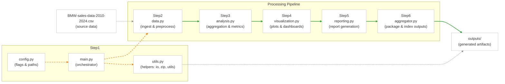

# Codebase diagram

```mermaid
flowchart LR
    %% Orchestration and entry point
    Main["main.py<br/>(orchestrator)"]

    %% Configuration and helpers
    Config["config.py<br/>(flags & paths)"]
    Utils["utils.py<br/>(helpers: io, zip, utils)"]

    %% Data pipeline stages
    Data["Step2<br/>data.py<br/>(ingest & preprocess)"]
    Analysis["Step3<br/>analysis.py<br/>(aggregation & metrics)"]
    Viz["Step4<br/>visualization.py<br/>(plots & dashboards)"]
    Report["Step5<br/>reporting.py<br/>(report generation)"]
    Agg["Step6<br/>aggregator.py<br/>(package & index outputs)"]
    Outputs["outputs/<br/>(generated artifacts)"]
    CSV["BMW-sales-data-2010-2024.csv<br/>(source data)"]

    %% high-level flows (simplified)
    %% orchestration edges: main controls the pipeline (single point of control)
    Main --> Data
    Config --> Main
    Main --> Utils

    %% core pipeline sequence (data flow — styled solid)
    Data --> Analysis
    Analysis --> Viz
    Viz --> Report
    Report --> Agg
    Agg --> Outputs

    %% supporting relations (auxiliary — styled dotted)
    CSV --> Data
    Utils --> Outputs

    %% link styling: orchestration (indexes 0-2) dashed orange, data flow (3-7) solid green, support (8-9) dotted gray
    linkStyle 0,1,2 stroke:#ff7f0e,stroke-width:2px,stroke-dasharray:5,5
    linkStyle 3,4,5,6,7 stroke:#2ca02c,stroke-width:2px
    linkStyle 8,9 stroke:#8c8c8c,stroke-width:1.5px,stroke-dasharray:2,2

    %% grouping for clarity
    subgraph "Step1"
        Main
        Config
        Utils
    end

    subgraph "Processing Pipeline"
        Data
        Analysis
        Viz
        Report
        Agg
    end

    classDef files fill:#fff,stroke:#bbb,stroke-width:1px;
    class Main,Config,Utils,Data,Analysis,Viz,Report,Agg,Outputs,CSV files;

    %% small note
    %% Note: main.py runs tests and incremental steps when flags in config enable them
```
