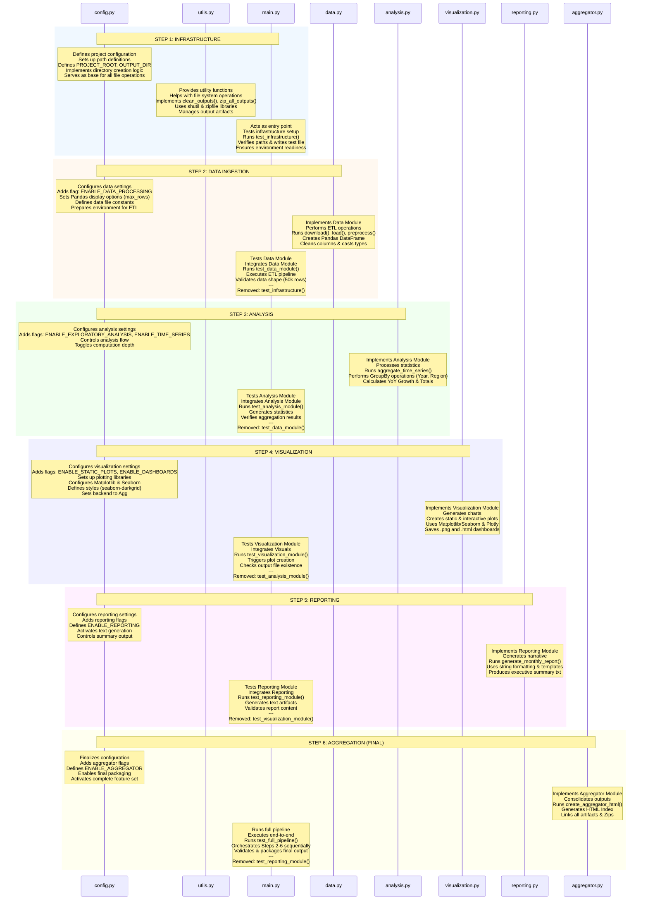

# Project Evolution Sequence Diagram

```mermaid
sequenceDiagram
    autonumber
    participant Config as config.py
    participant Utils as utils.py
    participant Main as main.py
    participant Data as data.py
    participant Analysis as analysis.py
    participant Viz as visualization.py
    participant Report as reporting.py
    participant Agg as aggregator.py

    %% STEP 1: INFRASTRUCTURE
    rect rgb(240, 248, 255)
    Note over Config, Main: STEP 1: INFRASTRUCTURE
    Note over Config: Defines project configuration<br/>Sets up path definitions<br/>Defines PROJECT_ROOT, OUTPUT_DIR<br/>Implements directory creation logic<br/>Serves as base for all file operations
    Note over Utils: Provides utility functions<br/>Helps with file system operations<br/>Implements clean_outputs(), zip_all_outputs()<br/>Uses shutil & zipfile libraries<br/>Manages output artifacts
    Note over Main: Acts as entry point<br/>Tests infrastructure setup<br/>Runs test_infrastructure()<br/>Verifies paths & writes test file<br/>Ensures environment readiness
    end

    %% STEP 2: DATA
    rect rgb(255, 248, 240)
    Note over Config, Data: STEP 2: DATA INGESTION
    Note over Config: Configures data settings<br/>Adds flag: ENABLE_DATA_PROCESSING<br/>Sets Pandas display options (max_rows)<br/>Defines data file constants<br/>Prepares environment for ETL
    Note over Data: Implements Data Module<br/>Performs ETL operations<br/>Runs download(), load(), preprocess()<br/>Creates Pandas DataFrame<br/>Cleans columns & casts types
    Note over Main: Tests Data Module<br/>Integrates Data Module<br/>Runs test_data_module()<br/>Executes ETL pipeline<br/>Validates data shape (50k rows)<br/>---<br/>Removed: test_infrastructure()
    end

    %% STEP 3: ANALYSIS
    rect rgb(240, 255, 240)
    Note over Config, Analysis: STEP 3: ANALYSIS
    Note over Config: Configures analysis settings<br/>Adds flags: ENABLE_EXPLORATORY_ANALYSIS, ENABLE_TIME_SERIES<br/>Controls analysis flow<br/>Toggles computation depth
    Note over Analysis: Implements Analysis Module<br/>Processes statistics<br/>Runs aggregate_time_series()<br/>Performs GroupBy operations (Year, Region)<br/>Calculates YoY Growth & Totals
    Note over Main: Tests Analysis Module<br/>Integrates Analysis Module<br/>Runs test_analysis_module()<br/>Generates statistics<br/>Verifies aggregation results<br/>---<br/>Removed: test_data_module()
    end

    %% STEP 4: VISUALIZATION
    rect rgb(240, 240, 255)
    Note over Config, Viz: STEP 4: VISUALIZATION
    Note over Config: Configures visualization settings<br/>Adds flags: ENABLE_STATIC_PLOTS, ENABLE_DASHBOARDS<br/>Sets up plotting libraries<br/>Configures Matplotlib & Seaborn<br/>Defines styles (seaborn-darkgrid)<br/>Sets backend to Agg
    Note over Viz: Implements Visualization Module<br/>Generates charts<br/>Creates static & interactive plots<br/>Uses Matplotlib/Seaborn & Plotly<br/>Saves .png and .html dashboards
    Note over Main: Tests Visualization Module<br/>Integrates Visuals<br/>Runs test_visualization_module()<br/>Triggers plot creation<br/>Checks output file existence<br/>---<br/>Removed: test_analysis_module()
    end

    %% STEP 5: REPORTING
    rect rgb(255, 240, 255)
    Note over Config, Report: STEP 5: REPORTING
    Note over Config: Configures reporting settings<br/>Adds reporting flags<br/>Defines ENABLE_REPORTING<br/>Activates text generation<br/>Controls summary output
    Note over Report: Implements Reporting Module<br/>Generates narrative<br/>Runs generate_monthly_report()<br/>Uses string formatting & templates<br/>Produces executive summary txt
    Note over Main: Tests Reporting Module<br/>Integrates Reporting<br/>Runs test_reporting_module()<br/>Generates text artifacts<br/>Validates report content<br/>---<br/>Removed: test_visualization_module()
    end

    %% STEP 6: AGGREGATION
    rect rgb(255, 255, 240)
    Note over Config, Agg: STEP 6: AGGREGATION (FINAL)
    Note over Config: Finalizes configuration<br/>Adds aggregator flags<br/>Defines ENABLE_AGGREGATOR<br/>Enables final packaging<br/>Activates complete feature set
    Note over Agg: Implements Aggregator Module<br/>Consolidates outputs<br/>Runs create_aggregator_html()<br/>Generates HTML Index<br/>Links all artifacts & Zips
    Note over Main: Runs full pipeline<br/>Executes end-to-end<br/>Runs test_full_pipeline()<br/>Orchestrates Steps 2-6 sequentially<br/>Validates & packages final output<br/>---<br/>Removed: test_reporting_module()
    end
```

