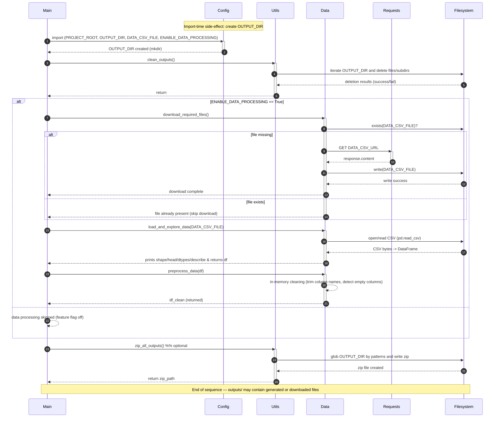

```mermaid
sequenceDiagram
    autonumber
    participant Main
    participant Config
    participant Utils
    participant Data
    participant HTTP as Requests
    participant FS as Filesystem

    Note over Config: Import-time side-effect: create OUTPUT_DIR
    Main->>Config: import (PROJECT_ROOT, OUTPUT_DIR, DATA_CSV_FILE, ENABLE_DATA_PROCESSING)
    activate Config
    Config-->>Main: OUTPUT_DIR created (mkdir)
    deactivate Config

    Main->>Utils: clean_outputs()
    activate Utils
    Utils->>FS: iterate OUTPUT_DIR and delete files/subdirs
    FS-->>Utils: deletion results (success/fail)
    Utils-->>Main: return
    deactivate Utils

    alt ENABLE_DATA_PROCESSING == True
        Main->>Data: download_required_files()
        activate Data
        Data->>FS: exists(DATA_CSV_FILE)?
        alt file missing
            Data->>HTTP: GET DATA_CSV_URL
            activate HTTP
            HTTP-->>Data: response.content
            deactivate HTTP
            Data->>FS: write(DATA_CSV_FILE)
            FS-->>Data: write success
            Data-->>Main: download complete
        else file exists
            Data-->>Main: file already present (skip download)
        end
        deactivate Data

        Main->>Data: load_and_explore_data(DATA_CSV_FILE)
        activate Data
        Data->>FS: open/read CSV (pd.read_csv)
        FS-->>Data: CSV bytes -> DataFrame
        Data-->>Main: prints shape/head/dtypes/describe & returns df
        deactivate Data

        Main->>Data: preprocess_data(df)
        activate Data
        Data-->>Data: in-memory cleaning (trim column names, detect empty columns)
        Data-->>Main: df_clean (returned)
        deactivate Data
    else
        Main-->>Main: data processing skipped (feature flag off)
    end

    Main->>Utils: zip_all_outputs()  %% optional
    activate Utils
    Utils->>FS: glob OUTPUT_DIR by patterns and write zip
    FS-->>Utils: zip file created
    Utils-->>Main: return zip_path
    deactivate Utils

    Note over Main,FS: End of sequence — outputs/ may contain generated or downloaded files
```
