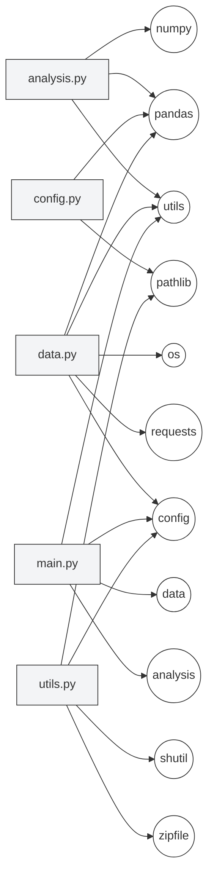

```mermaid
graph LR
  %% Files (boxes)
  analysis_py["analysis.py"]
  config_py["config.py"]
  data_py["data.py"]
  main_py["main.py"]
  utils_py["utils.py"]

  %% Modules (circles)
  analysis_m((analysis))
  config_m((config))
  data_m((data))
  numpy_m((numpy))
  os_m((os))
  pandas_m((pandas))
  pathlib_m((pathlib))
  requests_m((requests))
  shutil_m((shutil))
  utils_m((utils))
  zipfile_m((zipfile))

  %% Edges (file -> module)
  analysis_py --> numpy_m
  analysis_py --> pandas_m
  analysis_py --> utils_m

  config_py --> pathlib_m
  config_py --> pandas_m

  data_py --> os_m
  data_py --> requests_m
  data_py --> pandas_m
  data_py --> utils_m
  data_py --> config_m

  main_py --> config_m
  main_py --> utils_m
  main_py --> data_m
  main_py --> analysis_m

  utils_py --> shutil_m
  utils_py --> pathlib_m
  utils_py --> zipfile_m
  utils_py --> config_m

  %% Styling
  class analysis_py,config_py,data_py,main_py,utils_py fileNode;
  class analysis_m,config_m,data_m,numpy_m,os_m,pandas_m,pathlib_m,requests_m,shutil_m,utils_m,zipfile_m moduleNode;

  classDef fileNode fill:#f3f4f6,stroke:#333,stroke-width:1px;
  classDef moduleNode fill:#ffffff,stroke:#333,stroke-width:1px;
```